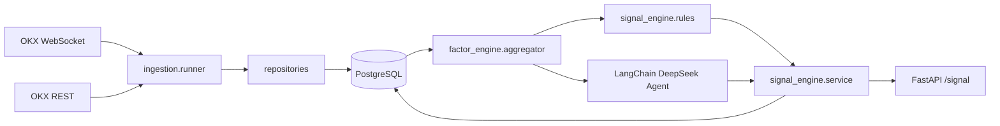

# ETH Trading Analysis Platform

基于 **Python 3.11 + FastAPI + asyncpg + LangChain (DeepSeek)** 的 ETH 实时交易分析平台。

实时采集 OKX 行情，落库 PostgreSQL，计算 4 类因子（资金流 / 订单簿 / 衍生品 / 市场结构），先用规则引擎做初判，再交给 LangChain Agent 输出严格 JSON Schema 的结构化交易建议（reason / risk / suggestion 字段统一**简体中文**输出）。

> **链上数据暂未启用**：原本预留的 `onchain_metrics` 表与 `MockOnchainProvider` 都保留着，等接入真实数据源（Glassnode / Nansen / Etherscan 等）后再恢复采集与因子计算。
>
> **声明**：本系统仅输出**交易建议**，**不执行任何交易**。

---

## 1. 目录结构

```text
usdt-rmb-python/
├── README.md
├── requirements.txt
├── .env.example
├── schema.sql                       # 在阿里云 PG 上一次性执行
├── app/
│   ├── main.py                      # FastAPI 入口（lifespan 启动后台任务）
│   ├── config.py                    # pydantic-settings
│   ├── logging_config.py
│   ├── container.py                 # 轻量 DI 容器
│   ├── data_ingestion/              # OKX WS / REST + 编排（链上 mock 暂未启用）
│   ├── data_storage/                # asyncpg 连接池 + 仓储
│   ├── factor_engine/               # 6 类因子计算
│   ├── signal_engine/               # 规则引擎 + LangChain Agent + 融合 service
│   └── api_service/                 # FastAPI 路由与依赖注入
└── scripts/
    └── run_ingestion.py             # 独立采集进程（可选）
```

## 2. 数据流



> 链上数据链路（onchain provider → repositories → onchain_metrics）当前未启用，等真实数据源接入后再恢复。

## 3. 启动步骤

### 3.1 准备 PostgreSQL（阿里云）

把 `schema.sql` 在你的 PG 实例上执行一次：

```bash
psql -h <aliyun_ip> -U <user> -d eth_analysis -f schema.sql
```

如果数据库还不存在，先 `CREATE DATABASE eth_analysis;`。

### 3.2 配置环境变量

```bash
cp .env.example .env
# 编辑 .env，至少填好：
#   DATABASE_URL=postgresql://eth_user:pwd@<aliyun_ip>:5432/eth_analysis
#   DEEPSEEK_API_KEY=sk-xxxxxxxx
#   SYMBOLS=ETH-USDT-SWAP
```

> 没有 DeepSeek Key 也可以启动：LLM 自动跳过，由规则引擎兜底输出信号。

### 3.3 安装依赖

```bash
python -m venv .venv
# Windows
.venv\Scripts\activate
# Linux/macOS
source .venv/bin/activate

pip install -r requirements.txt
```

### 3.4 启动 API（含采集 + 信号循环）

```bash
uvicorn app.main:app --host 0.0.0.0 --port 8000
```

启动后会自动：

1. 连接阿里云 PG 连接池
2. 建立 OKX WebSocket（trades / books5 / tickers / funding-rate / open-interest）
3. 每 60s REST 拉一次 funding rate + open interest 兜底
4. 每 30s 计算一次因子并生成交易信号写入 `signals` 表

> 原本"每分钟写一条 mock 链上指标"的轮询任务**已下线**，等接入真实链上数据源后再启用。

打开 <http://localhost:8000/docs> 直接调试。

### 3.5（可选）独立运行采集进程

如果想把采集和 API 拆成两个进程：

```bash
python -m scripts.run_ingestion           # 只跑采集
uvicorn app.main:app --port 8000          # 只跑 API + 信号循环（也会再起一份 WS，可改 SYMBOLS=空 关掉）
```

## 4. API

| 方法 | 路径 | 说明 |
| --- | --- | --- |
| GET  | `/health` | 健康检查 + LLM 是否可用 |
| GET  | `/factors?symbol=ETH-USDT-SWAP` | 实时计算并返回当前因子快照 |
| GET  | `/signal?symbol=ETH-USDT-SWAP` | 取最近一条已落库信号 |
| POST | `/signal/refresh?symbol=ETH-USDT-SWAP` | 立即生成一条新信号（同步返回） |

`/signal` 返回示例（reason / risk / suggestion 默认输出**简体中文**，bias 保持英文枚举）：

```json
{
  "timestamp": "2026-05-03T06:00:00+00:00",
  "symbol": "ETH-USDT-SWAP",
  "source": "rules+llm",
  "signal": {
    "bias": "long",
    "confidence": 0.62,
    "reason": "规则引擎: 净流入=+820000 USDT, 盘口失衡=+0.210, 资金费率=+0.000120, 持仓量变动=+0.83%, 趋势=上升",
    "risk": "关注资金费率反转与对侧大单墙",
    "suggestion": "建议在 1862.00 附近分批做多，止损放在支撑 1849.00 下方，目标看 1885.00（仅供参考，不构成交易指令）。"
  },
  "factors": { "...": "..." }
}
```

## 5. 因子说明

| 类别 | 指标 |
| --- | --- |
| 资金流 | `net_flow`（买卖差额，notional）、`cvd`（累计成交量差） |
| 订单簿 | `imbalance`、`bid_walls` / `ask_walls`（大单流动性墙） |
| 衍生品 | `funding_rate`、`oi_change_pct`、`next_settlement_at` |
| 市场结构 | `trend`（HH/HL → uptrend / LH/LL → downtrend / range）、`supports`、`resistances` |

> 链上因子（`net_exchange_flow` / `whale_tx_count` / `gas_fee_gwei` / `burn_rate`）以及参与者画像（`whale_active` / `smart_money_bias`）当前**未启用**，等接入真实链上数据源后会重新加回。

窗口大小由 `FACTOR_WINDOW_SECONDS` 控制，默认 1800 秒（30 分钟）。窗口太短会让 `market_structure` 因子在 1 分钟 bar 下凑不齐 6 根、`oi_change_pct` 也只能取到极少样本，因此**不建议低于 1200 秒**。

规则引擎的 4 个核心阈值 `RULE_NET_FLOW_USD_THRESHOLD` / `RULE_ORDERBOOK_IMBALANCE_THRESHOLD` / `RULE_OI_CHANGE_THRESHOLD` / `RULE_FUNDING_RATE_THRESHOLD` 也通过 `.env` 暴露，无需改代码。

## 6. 信号生成

1. **规则引擎**（`app/signal_engine/rules.py`）：4 类因子加权打分（资金流 0.35 / 订单簿 0.15 / 衍生品 0.20 / 市场结构 0.30），输出 `bias / confidence / reason / risk / suggestion`，得分 ∈ [-1, 1]。reason / risk / suggestion 默认**简体中文**输出。
2. **LangChain Agent**（`app/signal_engine/llm_agent.py`）：把因子 + 规则打分一起喂给 DeepSeek（OpenAI 兼容协议），用 `with_structured_output(TradingSignal, method="function_calling")` 强制返回严格 JSON；prompt 强制 reason / risk / suggestion 使用简体中文，bias 保持 long/short/neutral 英文枚举。
3. **融合服务**（`app/signal_engine/service.py`）：LLM 成功 → 用 LLM 输出；LLM 报错 / 未配 Key → 回退规则引擎输出。所有结果写入 `signals` 表，`factors` 字段保存原始因子 + 规则打分。

## 7. 可扩展性

- **多交易所**：实现新的 `ExchangeWebSocketClient` / `ExchangeRestClient`，加入 `AppContainer.create` 中的 `ws_clients` 列表即可。
- **多币种**：`.env` 中 `SYMBOLS=ETH-USDT-SWAP,BTC-USDT-SWAP` 逗号分隔，采集与信号循环会自动覆盖。
- **多策略**：`signal_engine/service.py` 中的融合逻辑可以替换为多策略路由；`SignalService` 暴露的接口保持稳定。
- **真实链上数据**：替换 `MockOnchainProvider` 为 Glassnode / Nansen / Etherscan 客户端（实现同名 `fetch_metrics`），并在 `app/data_ingestion/runner.py` 的 `start()` 中重新拉起 `_run_onchain_poller` 任务、在 `app/factor_engine/aggregator.py` 中恢复 `onchain` 因子聚合。

## 8. 工程要点

- **解耦**：每个模块只暴露明确的接口，互相通过容器注入，没有单文件大杂烩。
- **依赖注入**：`AppContainer` 一处装配，FastAPI 用 `Depends` 拉取。
- **全异步**：asyncpg / httpx / websockets / langchain `ainvoke` 全程 async。
- **日志**：统一 `logging_config.setup_logging`，所有模块用 `get_logger(__name__)`。
- **配置**：所有阈值、URL、Key 走 `.env`，代码里没有魔法数字硬编码。

## 9. 常见问题

**Q: OKX WebSocket 在国内连不上？**
A: 设置代理：`HTTPS_PROXY` / `HTTP_PROXY` 环境变量，`websockets` 与 `httpx` 都会读取。

**Q: 阿里云 PG 报 SSL 错误？**
A: 在 `DATABASE_URL` 末尾加 `?sslmode=require` 或 `?sslmode=disable`，按你的 PG 配置选。

**Q: `/signal` 返回 404？**
A: 信号循环还没跑出第一条数据。等 30s 或者直接 `POST /signal/refresh`。

**Q: DeepSeek 报 `function_calling` 不支持？**
A: 把 `app/signal_engine/llm_agent.py` 中 `method="function_calling"` 改成 `method="json_mode"`，或升级到最新版 `deepseek-chat`。
