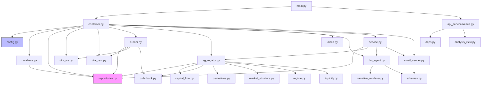
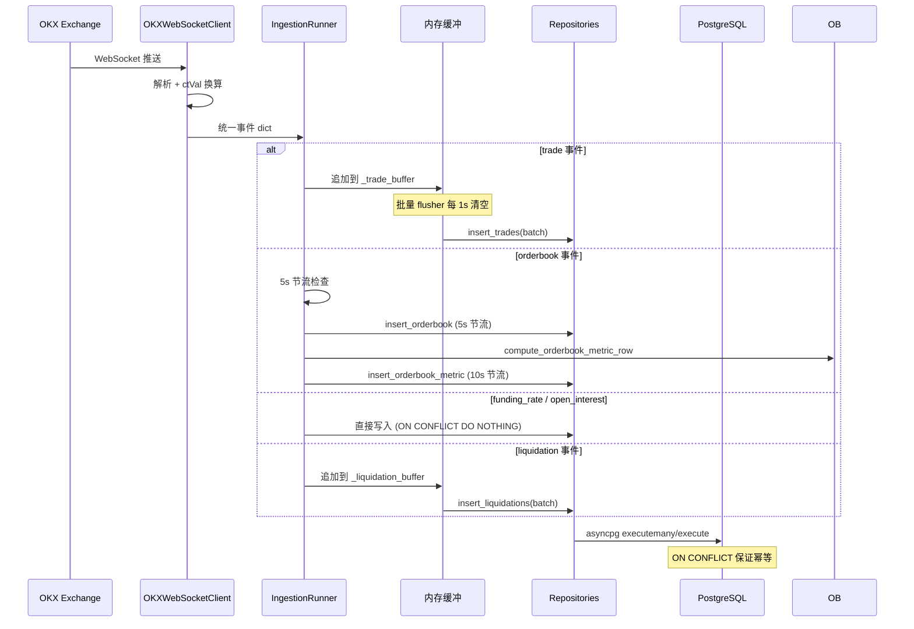
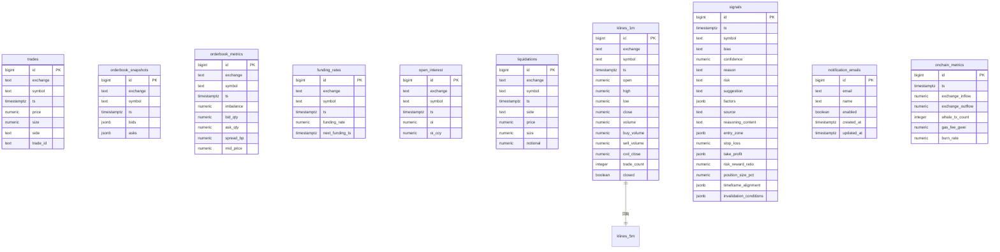
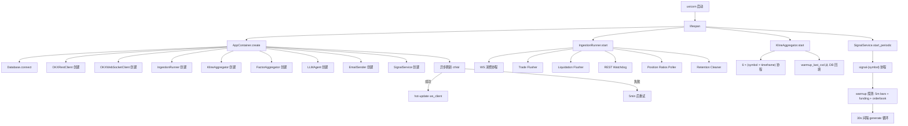

# SYSTEM_REFACTOR_ANALYSIS.md

> **ETH/USDT 实时交易分析平台 — 技术架构深度分析报告**  
> 分析师: Principal Software Architect (Claude Code)  
> 日期: 2026-05-31  
> 代码库版本: main @ b4ae790  
> Python 版本: 3.14  
> 代码总行数: ~8,500 行 (不含 .venv / .git)

---

## 目录

- [1. 系统总体架构](#1-系统总体架构)
- [2. 目录结构分析](#2-目录结构分析)
- [3. 技术栈分析](#3-技术栈分析)
- [4. 模块依赖关系](#4-模块依赖关系)
- [5. 数据流分析](#5-数据流分析)
- [6. 数据库分析](#6-数据库分析)
- [7. API 分析](#7-api-分析)
- [8. 状态管理分析](#8-状态管理分析)
- [9. 核心业务流程分析](#9-核心业务流程分析)
- [10. 技术债务识别](#10-技术债务识别)
- [11. 重构路线图](#11-重构路线图)

---

## 1. 系统总体架构

### 1.1 系统定位

本系统是一个 **ETH/USDT 永续合约实时交易分析平台**，属于量化交易信号生成工具链的"信号产出层"。

- **业务问题**: 为中频交易者（持仓数小时到 1 日）提供基于多维度市场数据的结构化交易建议
- **用户群体**: 加密货币交易者（通过 API / 邮件获取信号）
- **核心价值**: LLM-First 架构——所有方向判断由 DeepSeek 大模型做出，而非传统规则引擎
- **非目标**: 不执行任何交易，纯建议系统

### 1.2 架构风格

```
                    ┌─────────────────────────────────┐
                    │      AppContainer (DI)           │
                    │  一次性装配所有长生命周期组件      │
                    └───────────┬─────────────────────┘
                                │
        ┌───────────────────────┼────────────────────────┐
        │                       │                        │
        ▼                       ▼                        ▼
  ┌───────────┐         ┌───────────────┐        ┌──────────────┐
  │ 数据采集层 │         │  因子引擎层    │        │  信号引擎层   │
  │           │         │               │        │              │
  │ WS→REST  │────────▶│ K线聚合→因子  │───────▶│ 叙事→LLM→信号│
  │ →Repo→PG │         │ 计算→矩阵     │        │ →持久→邮件   │
  └───────────┘         └───────────────┘        └──────────────┘
        │                       │                        │
        └───────────────────────┼────────────────────────┘
                                ▼
                    ┌──────────────────────┐
                    │   FastAPI HTTP API   │
                    │   (14 个端点)        │
                    └──────────────────────┘
```

**架构特征**:
- **单体应用**: 所有组件运行在同一个 uvicorn 进程中
- **事件驱动**: WebSocket 推送 → 内存缓冲 → 批量落库 → 定时聚合
- **LLM-Native**: 方向判断 100% 由 LLM 做出，无规则引擎
- **异步全链路**: asyncpg / httpx / websockets / LangChain ainvoke

### 1.3 架构决策记录

| 决策 | 理由 | 来源文件 |
|------|------|----------|
| 每个周期一张 K 线表 (6 张) | 写入热路径独立，索引体积小，避免复合索引 | `schema.sql:96-106` |
| 不使用 PG 物化视图 | 不支持增量更新 + 未封盘 bar 滚动 | `klines.py:15-16` |
| 应用层定时增量而非触发器 | trades 表高频写入，触发器会成为 PG 瓶颈 | `klines.py:17` |
| Repository 模式而非 ORM | 高频写入场景下 ORM 开销不可接受 | `repositories.py:1-5` |
| LLM 固定 1800s 节流 | 之前"按波动率自适应"导致高波动分支过于频繁，成本超标 | `llm_agent.py:356-362` |
| Resend HTTP API 而非 SMTP | 国内云主机 SMTP 端口被封 | `email_sender.py:10-14` |

---

## 2. 目录结构分析

```
usdt-rmb-python/
├── app/                              # 主应用包
│   ├── __init__.py                   # 版本号 (0.1.0)
│   ├── main.py                       # FastAPI 入口 + lifespan (79 行)
│   ├── config.py                     # 全局配置 pydantic-settings (239 行)
│   ├── container.py                  # DI 容器 dataclass (239 行)
│   ├── logging_config.py             # 日志配置 (36 行)
│   │
│   ├── data_ingestion/               # 数据采集层
│   │   ├── __init__.py
│   │   ├── base.py                   # 抽象基类 (53 行)
│   │   ├── okx_ws.py                 # OKX WebSocket 客户端 (367 行)
│   │   ├── okx_rest.py               # OKX REST 客户端 + 熔断器 (753 行)
│   │   ├── runner.py                 # 采集编排器 (780 行)
│   │   └── onchain_mock.py           # 链上 Mock (33 行, 未启用)
│   │
│   ├── data_storage/                 # 数据存储层
│   │   ├── __init__.py
│   │   ├── database.py               # asyncpg 连接池封装 (189 行)
│   │   └── repositories.py          # 仓储层 (1328 行) ★ 最大单文件
│   │
│   ├── factor_engine/                # 因子引擎
│   │   ├── __init__.py
│   │   ├── aggregator.py             # 因子聚合器编排 (478 行)
│   │   ├── klines.py                 # K 线增量聚合 (370 行)
│   │   ├── capital_flow.py           # 资金流因子 (244 行)
│   │   ├── orderbook.py              # 订单簿因子 (545 行)
│   │   ├── derivatives.py            # 衍生品因子 (399 行)
│   │   ├── market_structure.py       # 市场结构因子 (515 行)
│   │   ├── regime.py                 # 市场状态判定 (144 行)
│   │   ├── liquidity.py              # 流动性地图 (230 行)
│   │   └── onchain.py                # 链上因子 (46 行, 未启用)
│   │
│   ├── signal_engine/                # 信号引擎 (LLM-First)
│   │   ├── __init__.py
│   │   ├── llm_agent.py              # LLM Agent 核心 (1137 行) ★ 第二大文件
│   │   ├── schemas.py                # TradingSignal pydantic (192 行)
│   │   ├── narrative_renderer.py     # 7 段叙事渲染 (848 行)
│   │   └── service.py                # 信号生成服务 (586 行)
│   │
│   ├── api_service/                  # API 层
│   │   ├── __init__.py
│   │   ├── routes.py                 # 14 个 HTTP 端点 (452 行)
│   │   ├── deps.py                   # FastAPI Depends (28 行)
│   │   └── analysis_view.py         # 前端友好序列化 (450 行)
│   │
│   └── notification/                 # 通知层
│       ├── __init__.py
│       └── email_sender.py           # Resend 邮件发送 (733 行)
│
├── scripts/                          # 运维脚本
│   ├── __init__.py
│   ├── run_ingestion.py              # 独立采集进程 (55 行)
│   └── init_database.py              # 数据库初始化 (140 行)
│
├── tests/                            # 测试
│   ├── __init__.py
│   └── conftest.py                   # pytest 全局配置 (17 行)
│
├── schema.sql                        # PostgreSQL DDL (368 行)
├── requirements.txt                  # Python 依赖 (48 行)
├── .env.example                      # 环境变量模板 (133 行)
├── pytest.ini                        # pytest 配置 (10 行)
├── CLAUDE.md                         # Claude Code 指南
└── README.md                         # 项目文档 (192 行)
```

### 各目录职责

| 目录 | 层次 | 职责 | 耦合方向 |
|------|------|------|----------|
| `app/data_ingestion/` | 外部适配层 | 连接 OKX API，标准化事件，写入 DB | → data_storage |
| `app/data_storage/` | 基础设施层 | 连接池管理，SQL 执行，幂等写入 | ← 被所有层依赖 |
| `app/factor_engine/` | 领域计算层 | 纯计算：从 DB 读数据 → 输出因子 dict | → data_storage |
| `app/signal_engine/` | 决策核心层 | LLM 调用 + prompt 工程 + 信号持久化 | → factor_engine, data_storage, notification |
| `app/api_service/` | 表现层 | HTTP 路由 + 请求/响应序列化 | → signal_engine, factor_engine, container |
| `app/notification/` | 外部适配层 | 邮件发送 (Resend API) | → signal_engine (schemas) |

---

## 3. 技术栈分析

| 类别 | 技术 | 版本约束 | 角色 |
|------|------|----------|------|
| Web 框架 | FastAPI | ≥0.115.5 | ASGI 路由 + 依赖注入 |
| ASGI Server | Uvicorn | ≥0.32.1 | 生产级 HTTP 服务器 |
| 配置 | pydantic-settings | ≥2.7.0 | .env → 类型安全配置 |
| 数据库驱动 | asyncpg | ≥0.31.0 | 异步 PostgreSQL |
| HTTP 客户端 | httpx | ≥0.27.2 | OKX REST API 调用 |
| WebSocket | websockets | ≥14.0 | OKX WS 实时推送 |
| LLM | langchain-openai | ≥0.2.9 | DeepSeek OpenAI 兼容协议 |
| 数值计算 | numpy | ≥2.3.2 | ATR/ADX/回归等因子计算 |
| 日志 | structlog (声明但未用) | ≥24.4.0 | 实际使用 stdlib logging |
| 邮件 | resend | ≥2.30.0 | Resend HTTP API |
| 测试 | pytest + pytest-asyncio | ≥8.3 / ≥0.24 | 异步测试框架 |
| Python | CPython | 3.14 | 运行时 |

### 技术栈评价

- ✅ **异步一致性**: 全链路 async (asyncpg/httpx/websockets/LangChain ainvoke)
- ✅ **类型安全**: pydantic v2 用于配置 + 信号 schema，字段级约束
- ⚠️ **structlog 声明但未用**: `requirements.txt` 声明 structlog，但 `logging_config.py` 使用 stdlib logging
- ⚠️ **无 ORM**: 手写 SQL 虽然性能好，但 repositories.py 已达 1328 行，维护成本上升
- ❌ **无测试覆盖**: `tests/` 目录下无任何实际测试文件

---

## 4. 模块依赖关系

### 4.1 依赖图



### 4.2 依赖热点

**`repositories.py` 是全局依赖热点**——被以下模块直接引用:
- `runner.py` (写入 trades/orderbook/funding/OI/liquidation)
- `aggregator.py` (读取 klines/funding/OI/orderbook_metrics/liquidations)
- `klines.py` (读写 klines 表)
- `llm_agent.py` (读取 signals 做节流)
- `service.py` (写入 signals + 读取 notification_emails)
- `routes.py` (通过 container.repos 读取 signals/notification_emails)

**`config.py` 是全局配置热点**——通过 `AppContainer.settings` 间接传递给所有组件。

### 4.3 循环依赖

当前代码库 **无循环依赖**。依赖方向严格单向:
```
main → container → {data_ingestion, data_storage, factor_engine, signal_engine, notification}
api_service → {signal_engine, factor_engine, container}
signal_engine → {factor_engine, data_storage, notification}
factor_engine → data_storage
data_ingestion → {data_storage, factor_engine(orderbook 仅一个函数)}
```

唯一值得注意的是 `runner.py` → `factor_engine/orderbook.py` 的 `compute_orderbook_metric_row` 调用。这是采集层反向依赖计算层的异常情况。

---

## 5. 数据流分析

### 5.1 行情数据写入流



### 5.2 信号生成流

```mermaid
sequenceDiagram
    participant LOOP as SignalService._run_loop
    participant FA as FactorAggregator
    participant REPO as Repositories
    participant NR as NarrativeRenderer
    participant LLM as LLMAgent
    participant DS as DeepSeek API
    participant PG as PostgreSQL
    participant EMAIL as EmailSender

    LOOP->>FA: compute(symbol)
    
    par 并行读取
        FA->>REPO: fetch_latest_orderbook
        FA->>REPO: fetch_latest_funding
        FA->>REPO: fetch_recent_oi (24h)
        FA->>REPO: fetch_liquidations_since (2h)
        FA->>REPO: fetch_orderbook_metrics_since (1h)
        FA->>REPO: fetch_funding_rates_since (7d)
    end
    
    loop 5 个周期 (5m/15m/1h/4h/1d)
        FA->>REPO: fetch_recent_klines(tf, 80 bars)
        FA->>FA: compute_capital_flow_from_klines
        FA->>FA: compute_derivatives_per_timeframe
        FA->>FA: compute_market_structure_from_klines
    end
    
    FA->>FA: _compute_alignment (mtf 共振)
    FA->>FA: _summarize_liquidations
    FA->>FA: detect_regime
    FA->>FA: build_liquidity_map
    FA-->>LOOP: 返回 factors dict

    LOOP->>LOOP: ATR floor 检查
    alt ATR < 0.25%
        LOOP-->>LOOP: 返回 neutral (不入库)
    end

    LOOP->>LLM: analyze(symbol, factors)
    LLM->>LLM: DB 节流检查 (signals.ts)
    alt 节流命中
        LLM-->>LOOP: 返回 from_cache=True
    else 需要调用 LLM
        LLM->>NR: render_sections(factors)
        NR-->>LLM: 7 段叙事文本
        LLM->>DS: ainvoke(prompt)
        DS-->>LLM: JSON 响应
        LLM->>LLM: schema 校验 + post-check
        LLM-->>LOOP: 返回 from_cache=False
    end

    alt from_cache=False
        LOOP->>REPO: insert_signal (持久化)
        alt bias ∈ {long, short}
            LOOP->>EMAIL: send_signal_alert (fire-and-forget)
        end
    end
```

### 5.3 API 请求流

```
HTTP Request
    → FastAPI Router (routes.py)
        → Depends(get_container) → app.state.container
        → Controller 逻辑 (内联在 routes.py)
            → Repositories (读 DB)
            → 或 SignalService.generate() (写 DB)
    → analysis_view.serialize_signal_full() (响应序列化)
    → JSON Response
```

---

## 6. 数据库分析

### 6.1 ER 图



### 6.2 表详细分析

| 表名 | 行量级/天 | 保留期 | 写入频率 | 唯一约束 | 索引 |
|------|-----------|--------|----------|----------|------|
| `trades` | ~100K-1M | 24h | 批量 ~50条/1s | (exchange,symbol,trade_id) | (symbol,ts DESC), (ts DESC) |
| `orderbook_snapshots` | ~17K | 24h | 5s/symbol | 无 | (symbol,ts DESC) |
| `orderbook_metrics` | ~8.6K | 24h | 10s/symbol | (exchange,symbol,ts) | (symbol,ts DESC) |
| `funding_rates` | ~1.4K | 永久 | WS~1/min + REST兜底 | (exchange,symbol,ts) | (symbol,ts DESC) |
| `open_interest` | ~28K | 永久 | WS~3s | (exchange,symbol,ts) | (symbol,ts DESC) |
| `liquidations` | ~100-1K | 永久 | 批量~1s | (exchange,symbol,ts,side,price,size) | (symbol,ts DESC) |
| `klines_*` ×6 | ~1.4K-1/天 | 永久 | 1s-60s/tf | (exchange,symbol,ts) | (symbol,ts DESC) |
| `signals` | ~2.9K | 30天 | 30min | 无 | (symbol,ts DESC) |
| `notification_emails` | <100 | 永久 | 手动CRUD | (email) | (enabled) |
| `onchain_metrics` | 0(未启用) | — | — | 无 | (ts DESC) |

### 6.3 关键 SQL 模式

**幂等写入**: 所有 INSERT 使用 `ON CONFLICT DO NOTHING` 或 `ON CONFLICT DO UPDATE`
```sql
-- trades: 幂等批量写入
INSERT INTO trades (...) VALUES (...) ON CONFLICT (exchange, symbol, trade_id) DO NOTHING

-- klines: 滚动更新未封盘 bar
INSERT INTO klines_1m (...) VALUES (...)
ON CONFLICT (exchange, symbol, ts) DO UPDATE SET
    high = GREATEST(klines_1m.high, EXCLUDED.high), ...
```

**服务端聚合**: K 线聚合使用 PG 端 SQL，避免传输大量 trades 到 Python
```sql
-- aggregate_trades_in_window: 服务端 OHLCV 聚合
SELECT COUNT(*)::INTEGER AS trade_count, MAX(price) AS high, ...
```

---

## 7. API 分析

### 7.1 端点清单

| 方法 | 路径 | 处理函数 | 来源 | 响应 |
|------|------|----------|------|------|
| GET | `/health` | `health()` | routes.py:83 | `{status, symbols, llm_enabled}` |
| GET | `/healthz` | `healthz()` | routes.py:93 | `{status, ws, rest}` 通道健康度 |
| GET | `/factors` | `get_factors()` | routes.py:136 | FactorAggregator.compute() 原始输出 |
| GET | `/signal` | `get_signal()` | routes.py:146 | DB 最新一条信号 |
| POST | `/signal/refresh` | `refresh_signal()` | routes.py:180 | 同步生成新信号 |
| GET | `/analysis/latest` | `get_latest_analysis()` | routes.py:210 | 前端友好视图 |
| GET | `/analysis/history` | `get_analysis_history()` | routes.py:245 | 分页历史 + 过滤 |
| GET | `/analysis/{id}` | `get_analysis_by_id()` | routes.py:293 | 单条详情 |
| GET | `/emails` | `list_notification_emails()` | routes.py:338 | 收件人列表 |
| POST | `/emails` | `create_notification_email()` | routes.py:349 | 新增收件人 (201) |
| GET | `/emails/{id}` | `get_notification_email()` | routes.py:372 | 单条查询 |
| PUT | `/emails/{id}` | `update_notification_email()` | routes.py:384 | 更新收件人 |
| DELETE | `/emails/{id}` | `delete_notification_email()` | routes.py:413 | 删除收件人 |
| POST | `/emails/test` | `send_test_notification_email()` | routes.py:425 | 测试邮件 |

### 7.2 API 设计评价

- ✅ **RESTful**: 资源命名清晰，HTTP 方法语义正确
- ✅ **分页**: `/analysis/history` 支持 limit + bias + source 过滤
- ✅ **可选字段**: `include_factors` / `include_reasoning` 控制响应体积
- ⚠️ **缺少分页游标**: `fetch_recent_signals_full` 用 `LIMIT` 而非 keyset pagination
- ⚠️ **无认证**: 所有端点无 auth middleware，内网部署可接受但不适合公网
- ⚠️ **无版本前缀**: API 路径没有 `/v1/` 前缀

---

## 8. 状态管理分析

### 8.1 状态分布

| 状态类型 | 存储位置 | 组件 | 持久性 |
|----------|----------|------|--------|
| 行情数据 | PostgreSQL | trades/orderbook/funding/OI/klines | 磁盘 |
| LLM 信号 | PostgreSQL | signals | 磁盘 (30天) |
| 邮件收件人 | PostgreSQL | notification_emails | 磁盘 |
| Trade 缓冲 | 内存 (List) | IngestionRunner._trade_buffer | 进程级 |
| 爆仓缓冲 | 内存 (List) | IngestionRunner._liquidation_buffer | 进程级 |
| CVD 起始值 | 内存 (Dict) | KlineAggregator._last_cvd_close | 进程级 (启动时从 DB 回填) |
| WS 健康度 | 内存 (Dict) | IngestionRunner._last_ws_event_at | 进程级 |
| 订单簿节流 | 内存 (Dict) | IngestionRunner._last_orderbook_write | 进程级 |
| LLM 并发锁 | 内存 (Dict) | LLMAgent._locks | 进程级 |
| LLM 节流时间 | PostgreSQL | signals.ts | 磁盘 (跨进程共享) |

### 8.2 状态一致性分析

- **进程重启安全性**: K 线 CVD 起始值通过 `_warmup_last_cvd` 从 DB 回填 ✅
- **跨进程 LLM 节流**: 以 `signals.ts` 为唯一真源，多副本共享 ✅
- **数据丢失风险**: Trade/Liquidation 缓冲在 flush 前丢失（进程崩溃时）⚠️
- **幂等性**: 所有写入操作使用 `ON CONFLICT` 保证重复写入安全 ✅

---

## 9. 核心业务流程分析

### 9.1 冷启动流程



### 9.2 LLM 决策链路（最关键业务流程）

这是系统的核心价值链，从因子到信号的完整路径：

```
FactorAggregator.compute(symbol)
    ├── 读取 6 类数据源 (7 次并发 DB 查询)
    ├── 5 周期 × 4 因子类 (capital/orderbook/derivatives/market_structure)
    ├── 叠加 mtf_alignment + regime + liquidity + liquidations
    └── 返回 ~50KB 因子矩阵 dict
            │
            ▼
NarrativeRenderer.render_sections(factors)
    ├── 市场状态 (regime + ATR + ADX)
    ├── 多周期方向 (5 箭头 + 共振解读)
    ├── 主动资金 (CVD/OI/net_flow 因果解读)
    ├── 衍生品 (funding)
    ├── 关键价位 (支撑阻力 + ATR 距离)
    ├── 流动性地图 (止损池 + 真空区)
    └── 爆仓窗口 (cascade 判读)
            │
            ▼
LLMAgent.analyze(symbol, factors)
    ├── DB 节流检查 (double-checked locking)
    ├── Prompt 组装 (system + few-shot + human)
    ├── DeepSeek API 调用 (300s 超时)
    ├── JSON 解析 + TradingSignal schema 校验
    ├── post-check (RR 诚实性)
    └── 返回 LLMAnalysisResult
            │
            ▼
SignalService.generate(symbol)
    ├── ATR floor 检查 (唯一服务端干预)
    ├── LLM 调用 (或缓存命中)
    ├── 条件入库 (from_cache=False)
    └── 条件邮件通知 (long/short + 发送成功)
```

---

## 10. 技术债务识别

### 10.1 架构债务

#### AD-1: Repositories 单文件巨型类 (1328 行)

**证据**: `app/data_storage/repositories.py` 包含 13 张表的全部读写操作  
**原因**: 项目从单表逐步演进到 13 张表，每张表 2-6 个方法，未及时拆分  
**风险**: 修改任意一张表的逻辑需要理解整个文件；merge conflict 概率高  
**建议**: 按 domain 拆分——`TradeRepo`, `KlineRepo`, `SignalRepo`, `EmailRepo` 等

#### AD-2: 采集层反向依赖因子引擎

**证据**: `app/data_ingestion/runner.py:37` 导入 `from app.factor_engine.orderbook import compute_orderbook_metric_row`  
**原因**: orderbook_metrics 的计算逻辑放在了 factor_engine，但 runner 需要在写入时实时计算  
**风险**: 采集层与计算层耦合，违反单向依赖原则  
**建议**: 将 `compute_orderbook_metric_row` 提取到 `data_storage/` 或独立的 `metrics.py`

#### AD-3: 因子引擎老接口残留

**证据**: 
- `capital_flow.py:33` 保留 `compute_capital_flow(trades)` 老接口
- `orderbook.py:37` 保留 `compute_orderbook_factors()` 老接口
- `market_structure.py:378` 保留 `compute_market_structure(trades)` 老接口
- `derivatives.py:31` 保留 `compute_derivatives_factors()` 老接口

**原因**: LLM-First 重构后从多路径退化为单路径，老接口未删除  
**风险**: 死代码增加维护负担；新开发者可能误用老接口  
**建议**: 删除所有标注"保留向后兼容"的老接口及其 `_resample_minute_ohlc` 等辅助函数

#### AD-4: Runner 单文件承担过多职责 (780 行)

**证据**: `app/data_ingestion/runner.py` 同时管理：
- WS 事件分发 + 节流
- Trade/Liquidation 批量缓冲与 flush
- REST watchdog 兜底拉取
- 数据保留清理

**原因**: 所有采集相关编排逻辑最初集中在一个类
**风险**: 单个类承担 5 种后台任务的启停和错误处理
**建议**: 拆分为独立 worker 类——`TradeBuffer`, `OrderbookWriter`, `RestWatchdog`, `RetentionCleaner` 等

### 10.2 工程债务

#### ED-1: 零测试覆盖

**证据**: `tests/` 目录仅有 `conftest.py` (17 行，只做 sys.path)，无任何测试文件  
**原因**: 项目快速迭代，未建立测试习惯  
**风险**: 重构/修改无法验证正确性；因子计算（ATR/ADX/BB/Value Area）尤其需要单测  
**建议**: 优先为以下纯函数添加单测：
1. `market_structure._wilder_atr()` — ATR 计算正确性
2. `market_structure._adx_14()` — ADX 计算正确性
3. `capital_flow._detect_divergence()` — 背离检测逻辑
4. `narrative_renderer.*` — 叙事渲染输出
5. `schemas.TradingSignal._post_validate()` — 价位顺序校验

#### ED-2: structlog 声明但未使用

**证据**: `requirements.txt:36` 声明 `structlog>=24.4.0`，但 `app/logging_config.py` 使用 stdlib logging  
**原因**: 早期计划使用 structlog，后简化为 stdlib  
**风险**: 无功能风险，但增加依赖体积  
**建议**: 要么迁移到 structlog，要么从 requirements.txt 移除

#### ED-3: `_safe_float` / `_to_float` 重复实现

**证据**: 以下文件各自实现了几乎相同的安全 float 转换：
- `capital_flow.py:174` → `_safe_float`
- `derivatives.py:389` → `_safe_float`
- `market_structure.py` → 直接 `float()`
- `narrative_renderer.py:44` → `_to_float`
- `llm_agent.py:61` → `_to_float_safe`
- `service.py:243` → `_safe_float`
- `analysis_view.py:61` → `_to_float`
- `email_sender.py` → `_fmt_price` 内部转换

**原因**: 各模块独立开发，未抽取公共工具  
**风险**: 行为不一致（有的处理 NaN/Inf，有的不处理）；修改一处容易遗漏其他  
**建议**: 抽取 `app/utils.py` 或 `app/types.py`，统一 `_safe_float(v) -> Optional[float]`

#### ED-4: 魔法值散落在代码中

**证据**:
- `runner.py:444` — `_WS_STALE_FUNDING_SECONDS = 5 * 60.0`（类常量但未通过 settings 暴露）
- `runner.py:445` — `_WS_STALE_OI_SECONDS = 60.0`
- `runner.py:447` — `_WATCHDOG_TICK_SECONDS = 15.0`
- `runner.py:449` — `_WATCHDOG_GRACE_SECONDS = 30.0`
- `okx_ws.py:197` — `await asyncio.sleep(25)` 心跳间隔硬编码
- `okx_rest.py:54` — `_BREAKER_BASE_COOLDOWN = 60.0`
- `klines.py:46` — `TIMEFRAME_SECONDS` 映射表

**原因**: 部分"运维级"参数未提升到 Settings  
**风险**: 调优需要改代码重新部署  
**建议**: 将 watchdog/熔断/心跳等参数统一纳入 `config.py`

#### ED-5: 缺少类型注解的工具函数

**证据**: `repositories.py` 底部 `_parse_delete_count(status: str) -> int` 是模块级函数，与 Repository 类无关联  
**原因**: 早期实现风格  
**风险**: 不影响功能，但降低可发现性  
**建议**: 移入 Database 类或独立 utils 模块

### 10.3 数据债务

#### DD-1: orderbook_snapshots 无唯一约束

**证据**: `schema.sql:22-31`，`orderbook_snapshots` 表无 UNIQUE 约束  
**原因**: 快照表设计为"追加写入"，节流由应用层控制  
**风险**: 若节流失效（bug/时钟跳变），同一秒可能写入多条重复快照  
**建议**: 添加 `UNIQUE(exchange, symbol, ts)` 约束，与 orderbook_metrics 对齐

#### DD-2: signals 表无唯一约束

**证据**: `schema.sql:73-86`，`signals` 表仅依赖 (symbol, ts DESC) 索引  
**原因**: 每次真实 LLM 调用产生一条记录，理论上不重复  
**风险**: 并发调用（锁失效时）可能写入重复信号  
**建议**: 虽然由 DB 节流 + asyncio.Lock 双重保护，但添加防御性约束更安全

#### DD-3: funding_rates / open_interest 保留策略缺失

**证据**: `runner.py:629-640` 的清理目标仅包含 trades / orderbook_snapshots / signals / orderbook_metrics  
**原因**: funding/OI 表增长较慢，未纳入清理  
**风险**: 长期运行后 funding_rates (7天查询窗口) 和 open_interest 会持续增长  
**建议**: 添加 `RETENTION_FUNDING_SECONDS` / `RETENTION_OI_SECONDS` 配置项

#### DD-4: JSONB 列无 schema 约束

**证据**: 
- `signals.factors` — 无 JSON schema 约束
- `signals.entry_zone` — 无 array length 约束
- `signals.take_profit` — 无 min length 约束
- `orderbook_snapshots.bids/asks` — 无结构约束

**原因**: PostgreSQL JSONB 原生不支持 JSON Schema  
**风险**: 损坏/格式的 JSONB 可能写入且无法在 DB 层发现  
**建议**: 评估 PG CHECK 约束（如 `jsonb_typeof(entry_zone) = 'array'`）

### 10.4 性能风险

#### PF-1: 因子聚合每次 compute 串行读取

**证据**: `aggregator.py:131-254`，`_compute_mtf` 方法中：
1. 先串行读取 orderbook/funding/OI/liquidations (7 次 await)
2. 再循环 5 个周期，每个周期串行 `fetch_recent_klines` (5 次 await)

**原因**: 初始设计未考虑查询并行化  
**风险**: 单次 `compute()` 约 12 次串行 DB 查询，延迟 ~200-500ms  
**建议**: 使用 `asyncio.gather` 并行化：
```python
# 共享数据并行
orderbook, funding, oi_history, liquidations = await asyncio.gather(
    repos.fetch_latest_orderbook(symbol),
    repos.fetch_latest_funding(symbol),
    repos.fetch_recent_oi(symbol, ...),
    repos.fetch_liquidations_since(symbol, ...),
)
# 5 周期 K 线并行
klines_map = await asyncio.gather(*[
    repos.fetch_recent_klines(tf, symbol, lookback) for tf in MTF_TIMEFRAMES
])
```

#### PF-2: funding_rates 7 天全量拉取

**证据**: `aggregator.py:200-212`，每次因子计算拉取 7 天 funding 历史  
**原因**: 需要 7 天窗口计算 `funding_rate_pct_rank_7d`  
**风险**: 随时间推移，单次查询返回行数从 ~10K 增长到 ~10K+（WS + REST 双路）  
**建议**: 
1. 在 DB 层用 `percent_rank()` 窗口函数替代 Python 端计算
2. 或缓存 7 天历史，每 funding 更新增量追加

#### PF-3: 爆仓滚动窗口全量拉取

**证据**: `aggregator.py:165-166`，每次因子计算拉取 2h 爆仓历史  
**原因**: 需要 5m/15m/1h 三个窗口的累计值  
**风险**: 高波动时段爆仓量暴增（级联爆仓），单次查询可能返回大量行  
**建议**: 考虑在 orderbook_metrics 同层添加"爆仓指标时序表"，或在 DB 端做窗口聚合

#### PF-4: factors JSONB 单条可达 50KB+

**证据**: `service.py:176` 写入 `factors={"factors": factors}`，factors dict 包含 5 周期完整因子矩阵  
**原因**: 保存完整因子快照以支持历史回溯  
**风险**: signals 表单行 ~50KB，100 条历史 = 5MB；`fetch_recent_signals_full` 需要 60s 超时  
**建议**: 
1. 列表接口不返回 factors（已实现 `include_factors=False`）✅
2. 考虑将 factors 快照存到独立表或压缩存储

---

## 11. 重构路线图

### Phase 1: 基础工程化 (1-2 周)

**目标**: 建立安全重构基础

| 优先级 | 任务 | 工作量 | 风险 |
|--------|------|--------|------|
| P0 | 添加核心因子计算单元测试 | 3 天 | 低 |
| P0 | 抽取 `_safe_float` 公共工具 | 0.5 天 | 低 |
| P1 | 从 requirements.txt 移除 structlog | 0.5 天 | 低 |
| P1 | 删除 factor_engine 老接口 | 1 天 | 低 |
| P2 | 为 DB 层添加防御性 CHECK 约束 | 1 天 | 中 |

### Phase 2: 架构改善 (2-3 周)

**目标**: 降低单文件复杂度

| 优先级 | 任务 | 工作量 | 风险 |
|--------|------|--------|------|
| P1 | 拆分 `repositories.py` 为 domain repos | 3 天 | 中 |
| P1 | 拆分 `runner.py` 为独立 workers | 2 天 | 中 |
| P2 | 将 `compute_orderbook_metric_row` 移出 factor_engine | 1 天 | 低 |
| P2 | 将 runner 中的魔法值提升到 config.py | 1 天 | 低 |
| P3 | API 路径添加 `/v1/` 前缀 | 0.5 天 | 低 |

### Phase 3: 性能优化 (2-3 周)

**目标**: 降低因子计算延迟

| 优先级 | 任务 | 工作量 | 风险 |
|--------|------|--------|------|
| P1 | `FactorAggregator._compute_mtf` 查询并行化 | 2 天 | 中 |
| P2 | funding 7 天分位数改为 DB 端 `percent_rank()` | 2 天 | 中 |
| P2 | 添加 funding/OI 保留策略 | 1 天 | 低 |
| P3 | 评估爆仓指标时序表可行性 | 3 天 | 高 |

### Phase 4: 可观测性 & 运维 (1-2 周)

**目标**: 提升生产环境可调试性

| 优先级 | 任务 | 工作量 | 风险 |
|--------|------|--------|------|
| P1 | 添加 Prometheus metrics (因子延迟/LLM 延迟/缓冲区大小) | 3 天 | 低 |
| P2 | 添加健康检查端点的告警阈值 | 1 天 | 低 |
| P2 | LLM token 使用量追踪到 DB | 2 天 | 低 |
| P3 | 添加 API 认证 (API Key / JWT) | 2 天 | 低 |

---

## 附录 A: 代码行数统计

| 文件 | 行数 | 占比 |
|------|------|------|
| `repositories.py` | 1328 | 15.5% |
| `llm_agent.py` | 1137 | 13.3% |
| `runner.py` | 780 | 9.1% |
| `narrative_renderer.py` | 848 | 9.9% |
| `okx_rest.py` | 753 | 8.8% |
| `email_sender.py` | 733 | 8.6% |
| `service.py` | 586 | 6.8% |
| `orderbook.py` | 545 | 6.4% |
| `market_structure.py` | 515 | 6.0% |
| `routes.py` | 452 | 5.3% |
| `analysis_view.py` | 450 | 5.3% |
| `aggregator.py` | 478 | 5.6% |
| `derivatives.py` | 399 | 4.7% |
| `klines.py` | 370 | 4.3% |
| `okx_ws.py` | 367 | 4.3% |
| `schema.sql` | 368 | 4.3% |
| `capital_flow.py` | 244 | 2.8% |
| `liquidity.py` | 230 | 2.7% |
| `config.py` | 239 | 2.8% |
| `container.py` | 239 | 2.8% |
| `schemas.py` | 192 | 2.2% |
| 其他 (< 200 行) | ~400 | 4.7% |
| **总计** | **~8,553** | 100% |

## 附录 B: 关键代码位置索引

| 关注点 | 文件 | 行号 |
|--------|------|------|
| FastAPI 入口 | `app/main.py` | 21-78 |
| DI 容器装配 | `app/container.py` | 62-167 |
| WS 事件分发 | `app/data_ingestion/runner.py` | 181-266 |
| Trade 批量 flush | `app/data_ingestion/runner.py` | 356-386 |
| REST 熔断器 | `app/data_ingestion/okx_rest.py` | 379-428 |
| K 线增量聚合 | `app/factor_engine/klines.py` | 227-306 |
| 因子矩阵编排 | `app/factor_engine/aggregator.py` | 131-323 |
| ATR 计算 | `app/factor_engine/market_structure.py` | 301-329 |
| ADX 计算 | `app/factor_engine/market_structure.py` | 118-185 |
| LLM Prompt | `app/signal_engine/llm_agent.py` | 162-338 |
| LLM 节流 | `app/signal_engine/llm_agent.py` | 564-649 |
| 信号 Schema 校验 | `app/signal_engine/schemas.py` | 114-191 |
| ATR floor 检查 | `app/signal_engine/service.py` | 255-292 |
| 邮件 HTML 模板 | `app/notification/email_sender.py` | 197-428 |
| API 路由定义 | `app/api_service/routes.py` | 83-451 |
