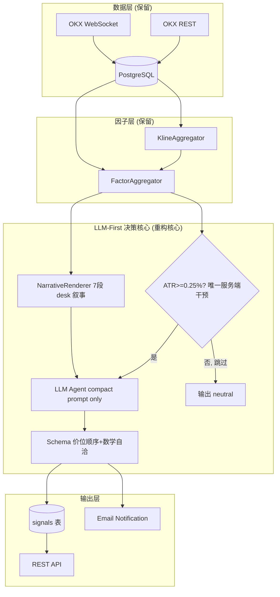

***

name: llm-first-aggressive-refactor
overview: 把当前"LLM 外壳 + 传统规则内核"的混合系统，激进重构为真正的 LLM-Native 决策架构：删除规则引擎、评估器、生命周期跟踪、4 道决策闸门、所有灰度 flag 与兼容路径，让 LLM 100% 拥有方向判断权,服务端只做数据收集 / 压缩 / 极端风险底线。
todos:

- id: stop-bg-tasks
  content: Container 层物理停掉 IC / evaluator / lifecycle 后台任务的创建（先停代码再删表）
  status: pending
- id: delete-modules
  content: "物理删除 4 个模块文件: rules.py / evaluator.py / lifecycle.py / ic\_calibrator.py"
  status: pending
- id: refactor-service
  content: "重写 service.py: 删 4 道闸门 + size override + lifecycle 入库, 只剩 ATR floor + LLM + persist + email (约 250 行)"
  status: pending
- id: refactor-llm-agent
  content: llm\_agent.py 删除老 prompt / 13 个 ASCII 渲染方法 / self-feedback 注入 / evaluation\_block / cache drift / dual-path post-check (保留 compact + thinking + post-check 简化版)
  status: pending
- id: refactor-schema
  content: "schemas.py 删除 \_llm\_first\_schema\_enabled + RR<2.0 dual-path, 保留单一路径: 价位顺序 + 数学自洽"
  status: pending
- id: enhance-narrative
  content: NarrativeRenderer 删除 legacy\_fallback + 新增 render\_liquidations 第 7 段 + 加强 desk 语义解读模板
  status: pending
- id: rewrite-system-prompt
  content: "SYSTEM\_PROMPT 进一步精简到 \~600 tokens (4 块: 角色+工作方式+硬约束+输出语言), 删除自我反馈段"
  status: pending
- id: scrub-config
  content: config.py + .env / .env.example 清扫 17 个 enable\_\* + 30+ 阈值字段, 重写模块 docstring 明确配置设计原则
  status: pending
- id: drop-tables
  content: "DB migration: DROP TABLE factor\_weights / signal\_lifecycle / signal\_evaluation"
  status: pending
- id: grep-verify
  content: "全仓 grep 验证: rule\_score / recent\_settled / evaluation\_summary / enable\_llm\_first\_\* / enable\_decision\_gates 五个关键词全部消失"
  status: pending
  isProject: false

***

# LLM-First 加密交易系统：激进重构方案

## 概览

当前系统已经走在 LLM-First 的方向上（compact prompt / NarrativeRenderer / `enable_llm_first_*` 系列 flag），但被**大量灰度兼容代码**拖累，呈现"LLM 外壳 + 传统规则内核 + 双轨制 flag"的中间形态。本方案做**单向激进收敛**：把所有 LLM-First 旁路变成主路、彻底物理删除 P3 老代码、删除规则引擎 / 评估器 / 生命周期、删除所有 `enable_*` 灰度 flag。

最终形态：

- **DELETE 4 个完整模块**：`rules.py` / `evaluator.py` / `lifecycle.py` / `ic_calibrator.py`
- **DELETE 3 张 DB 表**：`factor_weights` / `signal_lifecycle` / `signal_evaluation`
- **DELETE 17 个** **`enable_*`** **flag** 与 \~30 个 `decision_*` / `rule_*` / `ic_*` / `lifecycle_*` / `llm_first_*` 阈值
- **LLM Agent 单文件 3000+ → \~1200 行**（删除老 prompt / 13 个 ASCII 表渲染方法 / 4 道闸门相关代码 / cache drift 补丁 / dual-path post-check）
- **Service 1191 → \~250 行**（删除 4 道闸门 + size override + lifecycle 写入 + self-feedback）
- **Schema 259 → \~120 行**（删除 dual-path RR 校验 / `ENABLE_LLM_FIRST_SCHEMA` env 兜底）

***

## 一、彻底删除清单（按优先级）

### 1.1 整个模块物理删除

| 文件                                                                | 删除理由                                                                                                                                                                                                                                                                                                                                                   |
| ----------------------------------------------------------------- | ------------------------------------------------------------------------------------------------------------------------------------------------------------------------------------------------------------------------------------------------------------------------------------------------------------------------------------------------------ |
| [app/signal\_engine/rules.py](app/signal_engine/rules.py)         | 整个 RuleEngine + `_BASELINE_WEIGHTS`（5 regime × 5 tf × N factor）+ `_NORMALIZE_SCALES` + `_INVERSE_FACTORS` + `_OI_CHANGE_FACTORS` + `_signed_normalize` + `_resolve_oi_direction` + `_evaluate_legacy_score` + `_collect_atomic_values` + `_lookup_weight` + `_build_trade_plan` + `_render_reason` + `_render_risk` —— 全部都是"传统量化惯性",LLM 不需要任何"打分参考视角"。 |
| [app/signal\_engine/evaluator.py](app/signal_engine/evaluator.py) | Brier 是分类器校准指标,LLM 的 confidence 不是事件概率（范畴错误）;Sharpe 在 100 样本下没有统计意义;direction\_flip\_rate 反馈进 prompt 形成"判断不准 → 压 conf → 仓位缩 → PnL 更差"的死循环。                                                                                                                                                                                                             |
| `app/signal_engine/lifecycle.py`                                  | LifecycleTracker + signal\_lifecycle 表本质是给 evaluator + self\_feedback 服务的数据基础设施;evaluator / self\_feedback 删除后它就是孤儿。本系统只产建议、不掌握用户实际持仓,"信号是否被触发"这个语义本身就不严谨。                                                                                                                                                                                             |
| `app/factor_engine/ic_calibrator.py`                              | IC 校准任务、`factor_weights` 表、shadow\_mode 三件套——RuleEngine 删除后没有读者。                                                                                                                                                                                                                                                                                       |

### 1.2 [app/signal\_engine/service.py](app/signal_engine/service.py) 内部删除

- **整个 4 道决策闸门**：`_decision_atr_gate` / `_decision_cooldown_gate` / `_decision_direction_stability_gate` / `_decision_rule_conflict_gate`、`_make_gated_neutral_signal`、`_force_neutral_preserving_text`
  - 唯一例外：**保留 ATR-too-low 一道极端风险底线**,但搬到 `LLMAgent.analyze` 入口处的 1 行 if,不再叫"闸门"。
- **`_apply_size_override`**：服务端用半凯利 × 历史胜率覆盖 `position_size_pct` 是"规则引擎反向干预 LLM"的典型——LLM 的 size 听 LLM 的,schema 0.25 上限即终极保险。
- **`_fetch_lifecycle_feedback`**：lifecycle 表删了,方法本身死亡。
- **`generate()`** **中所有 lifecycle 入库逻辑、supersede 旧 pending、TODO 持仓管理层等大块注释**。
- **service** **`__init__`** **中的** **`rule_engine`** **参数**：直接删除依赖。

### 1.3 [app/signal\_engine/schemas.py](app/signal_engine/schemas.py) 内部删除

- **`_llm_first_schema_enabled()`** **+** **`ENABLE_LLM_FIRST_SCHEMA`** **env 变量整套**：永远走"LLM-First 路径"。
- **`_post_validate`** **的 RR<2.0 强制 neutral 老分支**：只保留"数学自洽"（risk>0、RR>0、价位顺序、plan 完整性）。
- **`object.__setattr__`** **双写 neutral 的兼容代码**：合并到单分支。

### 1.4 [app/signal\_engine/llm\_agent.py](app/signal_engine/llm_agent.py) 内部删除（最大量）

- **老** **`SYSTEM_PROMPT`**（174-332 行,6 级决策优先级 / 5 档校准锚点 / 6 项自检 / P1-P3 强约束）—— 全删,只保留 `SYSTEM_PROMPT_COMPACT`。
- **老** **`HUMAN_PROMPT`**（540-576 行,12 段 ASCII 表占位符）—— 全删,只保留 `HUMAN_PROMPT_COMPACT`。
- **老** **`FEW_SHOT_EXAMPLES`**（349-521 行,C+D+E 三条 \~3000 tokens）—— 全删,只保留 `FEW_SHOT_COMPACT` 一条拒绝交易示例。
- **`_build_prompt_inputs`** **老路径**（\~1583-1649 行）—— 全删;只保留 `_build_prompt_inputs_compact` 并改名为 `_build_prompt_inputs`。
- **13 个老 ASCII 表渲染方法**全删：`_render_mtf_factor_table` / `_render_alignment` / `_render_derivatives_text` / `_render_liquidations_table` / `_render_key_levels` / `_render_orderbook` / `_render_regime` / `_render_orderbook_dynamic` / `_render_position_ratios` / `_render_liquidity` / `_render_legacy_factor_block` / `_render_legacy_derivatives` / `_render_legacy_key_levels`。
  - 它们的功能已经被 `NarrativeRenderer` 完全取代。
- **`_render_self_feedback`** **/** **`_render_evaluation_block`**（约 \~250 行）：lifecycle / evaluator 删了,调用方消失。
- **`_render_self_feedback_compact`** **/** **`_render_evaluation_compact`**：同上,没有 recent\_settled 也没有 evaluation\_summary。
- **`_chain_compact_mode`** **/** **`_chain_thinking_mode`** **状态切换分支**：永远 compact,永远 thinking。
- **`_is_cache_stale_by_price`** **+ cache drift 整套**：补丁打补丁,节流策略改为单一档位。
- **`compute_min_interval`** **的 dual-path**：永远走 LLM-First 档位（300 / 600 / 1800）,删除 `llm_first_throttle` 分支。
- **`_load_recent_judgment`** **的 factors 漂移检查参数**：cache 命中 = cache 命中,简单。
- **`_post_check_signal`** **大幅简化**：只保留**第 1 项 RR 自报诚实性 + 第 5 项 take\_profit≥2**;删除第 2/3/4 项（RR 业务下限 / SL × ATR 倍数 / SL 绝对百分比）。
- **`_collect_cached_plan_kwargs`**：仍需要（cache 命中重建 TradingSignal）。
- **构造函数中的 8 个 flag startup summary 日志**（\~801-841 行）：所有 flag 都消失后这段日志失去意义。
- **`recent_settled`** **形参整条链路**（`analyze` / `_build_prompt_inputs` / service 透传）。

### 1.5 [app/container.py](app/container.py) 内部删除

- `ic_calibrator` 字段、创建逻辑、shutdown 调用
- `lifecycle_tracker` 字段、创建逻辑、shutdown 调用
- `signal_evaluator` 字段、创建逻辑、shutdown 调用
- `enable_mtf_factors` 分支：MTF 永远开（K线聚合器永远创建）
- `enable_factor_weights_table` 分支整段

### 1.6 [app/config.py](app/config.py) 删除的 settings 字段

```
# 灰度 flag（全删）
enable_compact_prompt / enable_narrative_renderer / enable_llm_first_gates
enable_llm_first_feedback / enable_llm_first_rule_engine / enable_llm_first_schema
enable_llm_first_cache_throttle / enable_decision_gates / enable_factor_weights_table
enable_lifecycle_tracking / enable_llm_self_feedback / enable_signal_evaluation
enable_mtf_factors / enable_adaptive_throttle / ic_calibrator_shadow_mode

# 规则引擎阈值（全删）
rule_net_flow_usd_threshold / rule_orderbook_imbalance_threshold
rule_oi_change_threshold / rule_funding_rate_threshold

# 决策闸门阈值（全删,只保留 ATR 一条）
decision_min_atr_pct_15m  ← 保留（极端风险底线）
decision_direction_flip_min_price_move_atr_1h  ← 删
decision_cooldown_consecutive_sl_threshold / decision_cooldown_minutes  ← 删
decision_max_position_size_pct / decision_kelly_aggressiveness  ← 删
decision_min_rr_ratio / decision_min_sl_distance_atr_15m / decision_min_sl_distance_pct  ← 删
decision_rule_llm_conflict_window / decision_rule_llm_conflict_winrate_threshold  ← 删
decision_cache_stale_drift_atr_15m / decision_cache_stale_min_age_seconds  ← 删

# IC 校准（全删）
ic_calibrator_*

# Lifecycle（全删）
enable_lifecycle_tracking / lifecycle_tick_seconds / lifecycle_default_ttl_minutes
lifecycle_default_ttl_hours / lifecycle_mark_price_max_age_seconds / llm_feedback_recent_n

# Evaluator（全删）
enable_signal_evaluation / signal_evaluation_interval_seconds / signal_evaluation_windows_minutes

# LLM-First 子档位（合并入 base 改名）
llm_first_cooldown_consecutive_sl_threshold ← 删
llm_first_min_interval_high_vol / _mid / _default
  → 改名为 llm_min_interval_high_vol / _mid / _default
```

### 1.7 DB schema 删除（migrations）

- DROP TABLE `factor_weights`
- DROP TABLE `signal_lifecycle`
- DROP TABLE `signal_evaluation`
- `signals` 表保留全部字段（含 plan 7 个结构化列、reasoning\_content）

### 1.8 .env 清理

`.env` / `.env.example` 中删除：所有 `ENABLE_DECISION_GATES` / `DECISION_*` / `IC_CALIBRATOR_*` / `ENABLE_LIFECYCLE_TRACKING` / `ENABLE_SIGNAL_EVALUATION` / `LIFECYCLE_*` / `LLM_FEEDBACK_RECENT_N` / 所有 `ENABLE_LLM_FIRST_*` / `ENABLE_COMPACT_PROMPT` / `ENABLE_NARRATIVE_RENDERER` / `ENABLE_MTF_FACTORS` / `ENABLE_FACTOR_WEIGHTS_TABLE` / `ENABLE_LLM_SELF_FEEDBACK` / `RULE_*` 行。

***

## 二、数据价值重排：什么进 prompt,什么不进

LLM 的 attention 在长 prompt 下会"稀释",所以**不是越多越好**,而是"高信息密度 + 结构化语义"。结合你列出的方向（order flow / OI / liquidation / CVD / regime / liquidity sweep / passive vs aggressive flow）：

### 2.1 一类核心（必须进 prompt,且要"解读化"）

| 数据                               | 价值                                        | 进入 prompt 的形态                                       |
| -------------------------------- | ----------------------------------------- | --------------------------------------------------- |
| **OI × 价格四象限**                   | 唯一能区分"真实建仓 vs 平仓离场",是 LLM 推理时的核心枢纽        | "多头加仓（OI↑+价↑,最强多）" / "空头平仓（OI↓+价↑,弱多）"等 desk 语义标签   |
| **CVD slope vs net\_flow vs 价格** | 三者背离 = 被动拉盘 / 诱多 / 诱空,是 desk trader 的核心判读 | "价涨但 CVD 走低 → 被动拉盘 / 诱多嫌疑"                          |
| **Funding rate 极端值**             | squeeze 风险前置预警                            | "+45bp,连续 6 个结算偏高 → long\_squeeze 一触即发"             |
| **散户多空比 vs 精英持仓比**               | 顶部 / 底部反指,比所有技术分析都靠前                      | "散户狂多 2.45 + 精英偏空 0.78 → 典型诱多顶部结构"                  |
| **多周期方向 + 共振度**                  | LLM 在多周期共振时方向准确率显著上升                      | 5 个箭头 + 解读 "高周期一致 → 主导多"                            |
| **关键价位 + 距当前价 N×ATR**            | "位置感",desk trader 真正关心的事                  | "距上方近阻 3585 仅 1.5×ATR(15m)"                         |
| **流动性地图（上下方止损池 + 真空）**           | 突破能否快速打到 / 止损易被插针                         | "上方真空 → 突破后下跌空间大"                                   |
| **Liquidations 滚动窗口（新增）**        | cascade signal = 强制平仓潮,反转的先行指标            | "近 15m: long\_liq 12.4 ETH, cascade=true → 多头清仓在进行" |
| **Regime + ATR % + ADX 强度**      | 状态识别一句话,LLM 据此调整入场风格                      | "向上突破,4h 收盘已 3 根上行;ADX 28.5 → 趋势确立"                 |

### 2.2 二类参考（可选,最多 1 行）

- **当前最新价**：必填,desk 第一眼要看的。

### 2.3 彻底不进 prompt 的内容（与现状的核心差异）

| 数据                                                          | 不进入理由                                        |
| ----------------------------------------------------------- | -------------------------------------------- |
| 规则引擎打分 / contributions                                      | 浅模型对深模型的"投票",污染 LLM 推理路径                     |
| 近 N 笔成绩单                                                    | LLM 每轮独立判断,旧 PnL 让 LLM 反向调整 confidence 进入死循环 |
| 系统级评估（Brier / Sharpe / flip\_rate）                          | 范畴错误                                         |
| "P3 预警: xx 触发降权" 类指令式语言                                     | 用规则去暗示 LLM 等于反 LLM-First                     |
| 6 级决策优先级 / 5 档校准锚点 / 6 项自检清单                                | "教 LLM 怎么想"的 over-instruction,是 prompt 噪音第一名 |
| 30+ 条 P1 / P2 / P3 硬约束                                      | 把决策权一条条还给规则;LLM 看到这些会变成"指标解释器"而非"trader"     |
| `rule_score` 占位符                                            | 同上,污染推理                                      |
| `account_contract_ratio`（与 `account_long_short_ratio` 通常一致） | 冗余,留前者即可                                     |

### 2.4 NarrativeRenderer 需要补的一段

当前 6 段叙事缺 **liquidations**——你明确列出这是核心信号,但 NarrativeRenderer 没渲染。**新增第 7 段** **`render_liquidations`**：

```
近 5m:  long_liq 8.2 ETH | short_liq 0.3 ETH  → 多头被清
近 15m: long_liq 12.4 ETH | short_liq 0.5 ETH | cascade=true
近 1h:  long_liq 45.6 ETH | short_liq 2.1 ETH（平均 +12×）
→ 持续大额多头爆仓,反弹动力多来自空头回补而非新增买盘
```

***

## 三、新 Prompt 结构（最终形态）

### 3.1 System Prompt（\~600 tokens,约现状的 5%）

保留现在的 `SYSTEM_PROMPT_COMPACT` 但**进一步精简**到只含 4 块：

1. **角色定位**（2 行）：资深加密永续 desk trader,专注 ETH-USDT-SWAP 中频交易。
2. **工作方式**（5 条）：
   - 先识别市场状态（趋势 / 震荡 / 突破 / 假突破 / 诱多诱空）
   - 找当前的"核心矛盾"——价格行为与资金流是否一致
   - 多周期共振优先信任高周期
   - 像在 trading desk 跟同事讨论,不要罗列指标
   - 不知道就说不知道,不要为了出方向编造逻辑
3. **硬约束（schema 强约束的口语版,4 条）**：
   - 价位顺序 long → sl < ez\_low ≤ ez\_high < tp1 < tp2
   - bias=long/short 时 entry\_zone / stop\_loss / 2 档 take\_profit 必须给齐
   - invalidation\_conditions ≥ 2 条,每条带具体价位 / 阈值
   - suggestion 末尾"仅供参考,不构成交易指令"
4. **输出语言**（2 行）：bias 英文枚举 + reason/risk/suggestion 简体中文 desk 语气。

**删除**（相比现状的 `SYSTEM_PROMPT_COMPACT`）：

- "关于自我反馈与系统统计"整段（lifecycle / evaluator 删了）
- "决策原则"中的"funding 极端 = 反向警告"等**具体指标提示**——降级为 NarrativeRenderer 内的"解读"标签,不出现在 SYSTEM 中（让 LLM 看数据自己判断）。

### 3.2 Human Prompt（\~1000 tokens,约现状的 15%）

```
合约: ETH-USDT-SWAP    时间: 2026-04-15 09:00    最新价: 3530.15

【市场状态】
向上突破（breakout）,4h 已上行 3 根
ATR(15m)=15.2（0.43%,正常）,ADX(1h)=28.5 → 趋势已确立

【多周期方向】
4h ↑ | 1h ↑ | 15m ↑ | 5m ↑ | 1d →    共振度 +0.72（dom=long）
高周期一致看多,低周期同向跟进 → 主导多,可顺势

【主动资金 vs 价格】
5m: net_flow +1.20M USD,CVD slope +0.0023,taker 52.5%,OI +0.34% → 主动买入真实
1h: net_flow +0.80M USD,CVD slope +0.0019,OI +1.80% → 多头加仓（OI↑+价↑,最强多）
4h: OI +0.42% → 高周期持仓格局稳定看多
综合: 资金行为多周期一致看多,方向可信

【衍生品】
funding +1.20bp（中性偏多但远未挤压,安全）
散户多空比 1.45（偏多 → 弱反指）
精英持仓比 2.10（明显偏多）
散户/精英: 一致偏多,无背离风险

【关键价位】
4h: 阻力 3625, 3680    支撑 3505, 3470
1h: 阻力 3585, 3625    支撑 3518, 3505
15m: 阻力 3585         支撑 3520
当前 3530 ─ 距上方近阻 3585 1.5×ATR(15m);距下方近撑 3518 0.8×ATR(15m)

【流动性地图】
上方止损池: 3625 (strong), 3680 (medium)
下方止损池: 3505 (medium), 3470 (weak)
距离: 上方最近池 2.69%

【Liquidations 滚动窗口】（新增）
近 5m:  long_liq 0.4 ETH  | short_liq 0.0 ETH
近 15m: long_liq 1.2 ETH  | short_liq 0.1 ETH
近 1h:  long_liq 8.5 ETH  | short_liq 0.5 ETH (cascade=false)
→ 多头被清量级很小,无急速反转结构

请基于以上市场状态判断方向,并按 schema 输出完整 JSON。
```

**新结构 7 段**（旧 12 段 + "参考视角"全删）：

- 市场状态 / 多周期方向 / 主动资金 vs 价格 / 衍生品 / 关键价位 / 流动性地图 / **Liquidations（新增）**

**结尾不再有**：

- ~~规则引擎打分: +0.62~~
- ~~近 5 笔成绩单~~
- ~~近 24h 系统统计~~

### 3.3 Few-Shot（仅 1 条 ≈ 1000 tokens,保留拒绝交易示例）

继续用 `FEW_SHOT_COMPACT` 的 D（transitional + 共振崩溃 + 诱多顶部 → 诚实拒绝交易）。

**理由**：

- 趋势单（long / short）LLM 天然会做,不需要例子
- "什么时候不出手"是 LLM 最难学也最关键的能力
- 1 条 vs 现状 3 条,省 \~2000 tokens

### 3.4 整体 token 预算

| 阶段          | 现状（compact 已开） | 重构后        |
| ----------- | -------------- | ---------- |
| SYSTEM      | \~1500         | \~600      |
| FEW-SHOT    | \~1000         | \~1000     |
| HUMAN（叙事）   | \~1500         | \~1000     |
| HUMAN（参考视角） | \~600          | 0          |
| **总计**      | **\~4600**     | **\~2600** |

输入侧再减 \~40%,且**每个 token 都是有信息密度的 desk 叙事**,无指标堆砌。

***

## 四、解释层 / NarrativeRenderer 重构

NarrativeRenderer 主体保留（这是当前最 LLM-Native 的设计）,但要做 4 处修改：

### 4.1 删除 legacy fallback 路径

[narrative\_renderer.py](app/signal_engine/narrative_renderer.py) 的 `_render_legacy_fallback_sections` —— `enable_mtf_factors` 永远 True 后,老聚合器路径死亡。

### 4.2 新增 `render_liquidations` 段

挂到 `render_sections` 返回值中作为第 7 段。占位符在 `HUMAN_PROMPT_COMPACT` 中加 `{liquidations_compact}`。
渲染逻辑参考第 2.4 节的目标输出。

### 4.3 输出格式升级：从"指标 + 解读"到"市场叙事"

**对照你给的对比要求**：

不要写：

> "5m net flow positive but CVD negative"

要写：

> "5m: net\_flow +1.20M USD 但 CVD slope -0.0011 —— 价格被动抬升,主动买盘未跟随,更像空头回补而非真实趋势启动。"

现状 `_verdict_capital` 已经做到 60%,但还需要把"动作 → 含义 → 推论"这条链路写得更完整：

| 现状输出                              | 重构后输出                                               |
| --------------------------------- | --------------------------------------------------- |
| "价涨但 CVD 走低 → 被动拉盘 / 诱多嫌疑"        | "价格被动抬升,主动买盘未跟随,短线更像空头回补而非真实趋势启动"                   |
| "多头加仓（OI↑+价↑,最强多）"                | "OI 与价格同步上升 = 多头真实建仓中,非短期投机推升"                      |
| "funding +45bp,long\_squeeze 风险高" | "funding +45bp 已偏高,多头持仓拥挤;任何反向触发（如 4h MA 跌破）容易引发挤压" |

### 4.4 reason / risk / suggestion 输出风格统一为 desk 语言

这部分由 LLM 输出,不由服务端渲染。但要在 SYSTEM\_PROMPT 的"输出语言"段强化（少量例子,对照写）：

```
不要写：RR=0.59 alignment=0.20 CVD divergence OI short_cover

要写：盈亏比偏低（约 0.6）,多周期共振也已崩溃;从订单流看更像
     空头回补而非新一轮趋势启动,强追多容易吃到反向止损。
```

***

## 五、Config / 灰度 flag 大清扫

### 5.1 总数对比

| 类别              | 现状                              | 重构后                                                     |
| --------------- | ------------------------------- | ------------------------------------------------------- |
| `enable_*` flag | 17                              | 1（`enable_email_notification`）                          |
| 阈值字段            | 60+                             | \~15（数据采集 / DB pool / OKX / LLM 配置 / ATR floor / email） |
| 老兼容字段           | `lifecycle_default_ttl_hours` 等 | 全删                                                      |

### 5.2 最终保留的 `Settings` 字段（约 35 个,按段分组）

```python
# DB
database_url / db_pool_min_size / db_pool_max_size /
db_max_inactive_connection_lifetime / db_write_max_retries / db_write_retry_backoff

# OKX
okx_ws_url / okx_rest_url / symbols / exchanges / orderbook_depth /
okx_rest_timeout / okx_rest_max_retries / okx_rest_retry_backoff /
okx_rest_trust_env / okx_rest_proxy / rest_poll_interval_seconds /
default_contract_value / orderbook_min_interval_seconds

# 数据采集与因子
factor_window_seconds / signal_interval_seconds / liquidity_wall_multiplier /
kline_tick_seconds_{1m,5m,15m,1h,4h,1d} / mtf_lookback_bars /
mtf_volume_zscore_window / mtf_divergence_lookback /
liquidation_windows_minutes / liquidation_cascade_multiplier /
position_ratios_poll_interval_seconds / position_ratios_period /
orderbook_metrics_window_seconds / orderbook_metrics_baseline_seconds /
orderbook_metrics_min_interval_seconds / funding_pct_rank_window_seconds /
regime_adx_trending_threshold / regime_adx_ranging_threshold /
liquidity_round_level_step_usd / liquidity_max_levels_per_side

# LLM
deepseek_api_key / deepseek_base_url / deepseek_model /
deepseek_thinking_enabled / deepseek_reasoning_effort /
llm_temperature / llm_timeout /
llm_min_interval_high_vol / llm_min_interval_mid / llm_min_interval_default
# ↑ 三档自适应是唯一保留的 LLM 调用策略

# 数据保留
retention_trades_seconds / retention_orderbook_seconds /
retention_signals_seconds / retention_run_interval_seconds

# 极端风险底线（唯一保留的服务端"干预"）
decision_min_atr_pct_15m  # 0.0025;ATR<0.25% 时跳过 LLM 直接 neutral

# 邮件通知
enable_email_notification / resend_api_key / resend_from / resend_timeout

# API
api_host / api_port / log_level
```

### 5.3 配置设计原则（写进 config.py 的模块 docstring）

```
1. 每个字段都必须是"运维参数"（URL / Key / 超时 / 节流 / 采样窗口）,
   而不是"决策开关"。
2. 任何形如 enable_xxx 的 flag 都视为代码异味,必须经过 review。
3. 任何形如 decision_xxx / rule_xxx 的阈值都视为"传统量化惯性",
   除非属于明确的极端风险底线（数学上不可交易）,否则不允许新增。
4. 不允许通过 settings 影响 LLM 方向判断——LLM 的方向判断逻辑只通过
   prompt 模板传递;改 prompt 必须改代码 + git review。
```

***

## 六、新架构数据流



***

## 七、最终代码体积估算

| 文件                     | 现状     | 重构后      | 减少                    |
| ---------------------- | ------ | -------- | --------------------- |
| service.py             | 1191 行 | \~250 行  | -79%                  |
| llm\_agent.py          | 3022 行 | \~1200 行 | -60%                  |
| schemas.py             | 259 行  | \~120 行  | -54%                  |
| rules.py               | 1071 行 | **删除**   | -100%                 |
| evaluator.py           | 377 行  | **删除**   | -100%                 |
| lifecycle.py           | （未读）   | **删除**   | -100%                 |
| ic\_calibrator.py      | （未读）   | **删除**   | -100%                 |
| narrative\_renderer.py | 802 行  | \~850 行  | +6%（加 liquidations 段） |
| config.py              | 553 行  | \~250 行  | -55%                  |
| container.py           | 319 行  | \~210 行  | -34%                  |

整体业务代码量 **-65%**,且推理路径完全单向、无双轨。

***

## 八、风险与不要做的事

- **不要保留任何"运行时灰度开关"**。要回滚就 git revert,不允许 .env 配置切换"是不是 LLM-First"。
- **不要在 service / schema / llm\_agent 任意位置出现** **`rule_score`** **/** **`recent_settled`** **/** **`evaluation`**。grep 通过的标准就是这三个词全消失。
- **唯一服务端"干预" = ATR-too-low 极端底线**。若未来想加新底线,必须满足"数学上不可交易"（如 ATR=0、price=0、订单簿全失效）,不允许"我觉得这种行情风险高"类的主观规则。
- **DB migration 要单独评审**。`signal_lifecycle` 表删除会让既有 lifecycle 后台任务在过渡期报错——按 todo 顺序先停代码再 drop 表。
- **不要试图"软删除"模块（保留文件但所有代码 commented out）**。文件物理删除,让 git history 保留考古路径。

